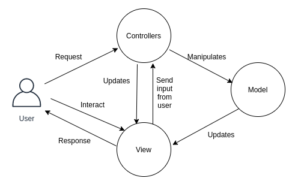
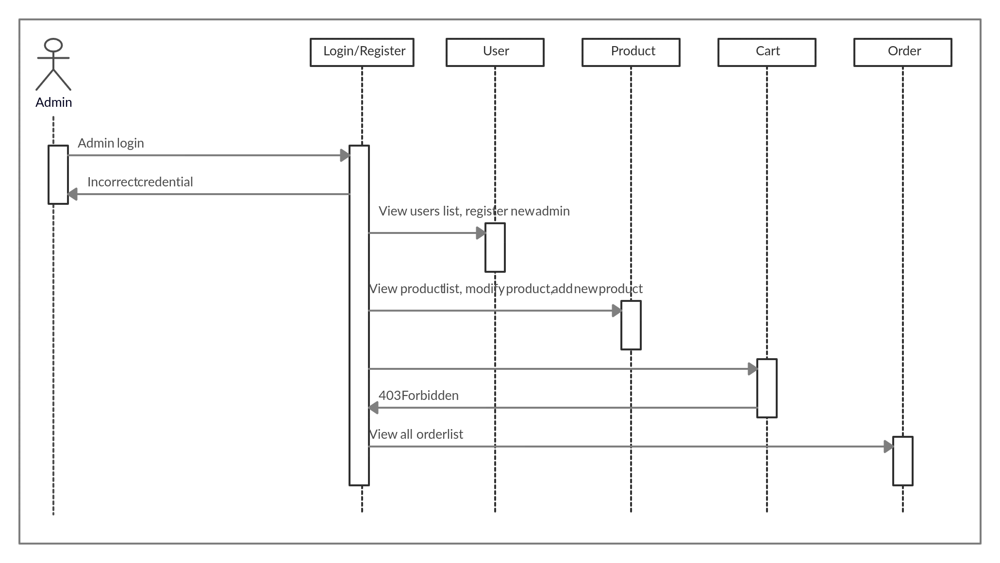
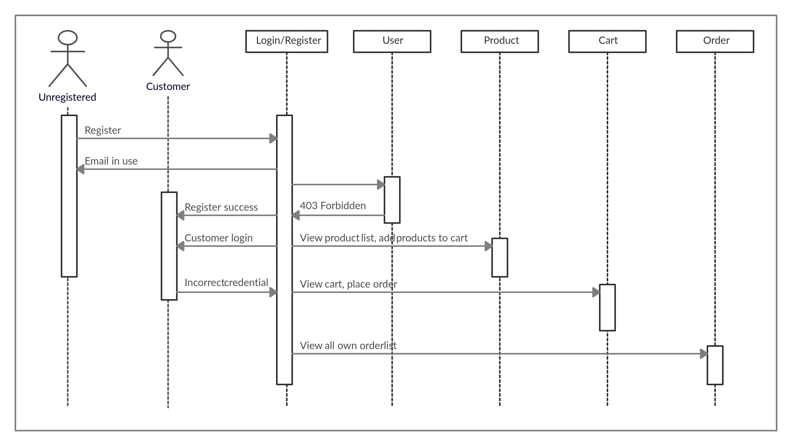

# Group 75

Member1:  Duy Anh Vu, duy.a.vu@tuni.fi, H294381, 
resposible for:
- refactoring all files to use FP and follow clean code (except routes.js)
- implementing JWT and fix all tests to test JWT instead of Basic authentication
- implementing users tab
- add login functionality (use JWT)
- migrating "local database" to use data persisted in MongoDB
- managing packages, including prettier plugin for cleaner coding
- writing tests for sorting functionalities
- refactoring CSS

Member2:  The Anh Nguyen, anh.t.nguyen@tuni.fi, H292126, 
resposible for: 
- Implementing models for user, order, product
- Implementing controller for user, product, order 
- Modifying public HTML files; add addProduct, order HTML files
- Implement view for order, addProduct rendering
- Implement product adding, modifying and deleting
- APIs for products, orders in routes
- Write Product schema related tests


# WebDev1 coursework assignment

A web shop with vanilla HTML, CSS.

# Links to Heroku applications

1. https://webdevgroup75.herokuapp.com/ - master branch, with CSS changes, and without JWT. We submitted this one
2. https://webdev75.herokuapp.com/ - JWT branch, with JWT authentication, and without CSS changes.


### The project structure

```
.
├── index.js                --> Homepage
├── package.json            --> Information about project, including packages and scripts,...
├── routes.js               --> Include routes to handle requests
├── auth                    --> Authorization
│   └──  auth.js            --> Get the current user for authorization
├── controllers             --> Includes methods for API controller
│   ├── orders.js           --> controller for order
│   ├── products.js         --> controller for product
│   └── users.js            --> controller for user
├── models                  --> Schemas for user, order, product
│   ├── orders.js           --> Schema for order
│   ├── products.js         --> Schema for product
│   └── users.js            --> Schema for user
├── public                  --> UIs
│   ├── img                 --> Diagrams
│   ├── js                  --> scripts for UIs
│   └── css                 --> styles of pages
├── utils                   --> include utilities for requests, responses, products, users
│   ├── requestUtils.js     --> utilities related to request
│   ├── responseUtils.js    --> utilities related to response
│   ├── products.js         --> utilities related to products
│   └── Utils.js            --> utilities related to users
└── test                    --> tests
│   ├── auth                --> Authorization test
│   ├── controllers         --> Method tests
│   ├── models              --> User Schema tests
│   ├── utils               --> utilities tests for request and response
└── └── own                 --> Product Schema tests


```

## The architecture 
The system follows MVC structure. In this architecture, client's request would go through a router, which would call logics in Controller. Controller would communicate with the Models to get the data to handle the logics. Models communicates with our database, which is MongoDB, to bring data to Controller. Static web page will be sent as HTML via the View to client to render.database.
    

Ofcourse, the request should be authenticated before and further logics happen. The final system support authentication which allows user to access suitable rights with their roles. Authentication is done using Basic Authentication in master branch, and JWT in "JWT" branch.  
The backend is built following REST api using NodeJS. Some example operations are:
- User
  - Add user (POST)
  - Delete user (DELETE)
  - Modify user (PUT)
  - Get all users (GET)
- Product
  - Add product (admin only) (POST)
  - Delete product (DELETE)
  - Update product (PUT)
  - Get all products (GET)
Below are sequence diagrams of specific actions that each role can get access to:
    
    

## Tests and documentation

1. [Customer can sort products by name][test1]
2. [Customer can sort products by price][test2]
3. [Product's name must be given][test3]
4. [Product's name must not be empty][test4]
5. [Product's name must not contain only spaces][test5]
6. [Product's name must not exceed 50 characters][test6]
7. [Product's image url must be legal][test7]
8. [Product's price must be given][test8]
9. [Product's price must not be zero nor negative][test9]
10. [Product's price must be a number][test10]

[Mocha test and test File associated tests 1 and 2][test11]

[Mocha test and test File associated remaining tests][test12]

[test1]: https://course-gitlab.tuni.fi/webdev1-2020-2021/webdev1-group-75/-/issues/2
[test2]: https://course-gitlab.tuni.fi/webdev1-2020-2021/webdev1-group-75/-/issues/5
[test3]: https://course-gitlab.tuni.fi/webdev1-2020-2021/webdev1-group-75/-/issues/9
[test4]: https://course-gitlab.tuni.fi/webdev1-2020-2021/webdev1-group-75/-/issues/11
[test5]: https://course-gitlab.tuni.fi/webdev1-2020-2021/webdev1-group-75/-/issues/12
[test6]: https://course-gitlab.tuni.fi/webdev1-2020-2021/webdev1-group-75/-/issues/13
[test7]: https://course-gitlab.tuni.fi/webdev1-2020-2021/webdev1-group-75/-/issues/23
[test8]: https://course-gitlab.tuni.fi/webdev1-2020-2021/webdev1-group-75/-/issues/14
[test9]: https://course-gitlab.tuni.fi/webdev1-2020-2021/webdev1-group-75/-/issues/15
[test10]: https://course-gitlab.tuni.fi/webdev1-2020-2021/webdev1-group-75/-/issues/17
[test11]: https://course-gitlab.tuni.fi/webdev1-2020-2021/webdev1-group-75/-/blob/master/test/own/ui.test.js
[test12]: https://course-gitlab.tuni.fi/webdev1-2020-2021/webdev1-group-75/-/blob/master/test/own/utils.test.js

# Additional features
1. Jsonwebtoken (JWT) and login page (in JWT branch)  
- We have added a new page for user to login. User must login in order to access other pages. At this time, we are using server-side rendering, so we let the server to handle the permissions regarding accessibilies to pages and functionalities.
- We change the authentication method to JWT. The token, once signed by the server, would be sent back to the client and stored in the localStorage. This way of storing token is quite vulnerable to XSS attacks. More reasons would be discussed further in Security section.
2. Sorting (in master branch)  
We have implemented the buttons to sort the products in different orders.
- Sort by name, increasing
- Sort by name, decreasing
- Sort by price, increasing
- Sort by price, decreasing

## Security concerns

* Json web token  
Currently, the token is saved in browser's localStorage. This is highly vulnerable as XSS can easily happen due to the fact that the token
is available to all JavaScript. We thought about saving the token to HttpOnly Cookies, but this would require whole reimplementation as well
as tests fixing. In fact, both HttpOnly Cookies and localStorage are vulnerable to XSS attacks in some ways if the web itself does not do
well to prevent such attacks.  
Cookies are safer in a sense that attackers cannot get the token for later uses, but if they can send the request to server, the token is
attached with the request automatically, and this is also harmful for the client. Most importantly, cookies are vulnerable to CSRF attacks.
This can be mitigated using sameSite flag or some sort of anti-CSRF tokens.

* Other things
1. XSS: We have prevented some dangerous input from users into the forms. However, for the non-persistent XSS, we have not tested it carefully,
but from some preliminary tests, it seems to be prevented.
2. Session hijacking: We have not taken any action to mitigate this. This attack is very likely to happen to our app as the authentication
is not strong enough.
3. CSRF: We did not protect this attack too carefully. It is quite liably to happen, especially when admins are logged in. Their request
would contain the cookie automatically, so attackers can definitely make a call to the API.
4. SQL/NOSQL injection: We are using MongoDB, which can be vulnerable to NOSQL injection due to the free-form of JSON documents. We already have
some checkings to ensure the data coming to MongoDB is following the predefined schema (Ofcourse we do not leak the database error to client).

